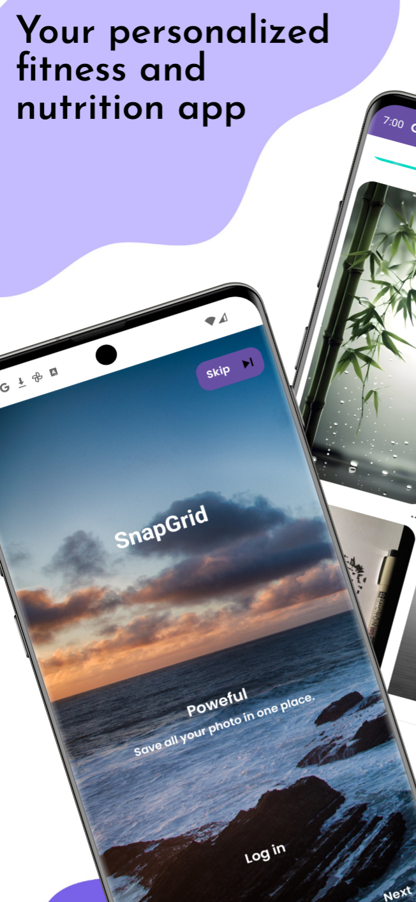
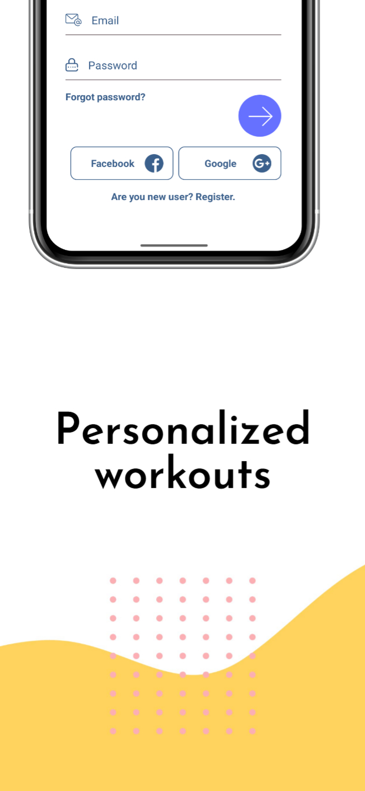
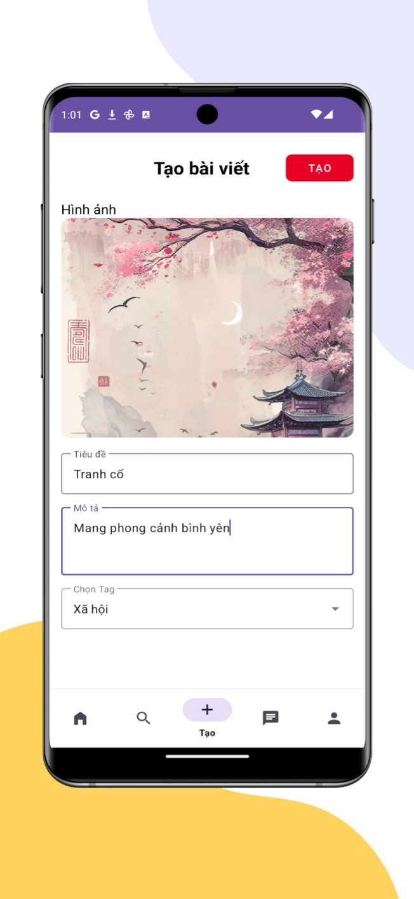

<div align="center">
  
  <h1>SnapGrid</h1>
  <p>
    <a href="https://play.google.com/store/apps/details?id=com.jackphan.snapgrid">
      
    </a>
  </p>
  
  <p>
    
    
  </p>
</div>

## 📱 Screenshots

<div align="center">
  
  
  
  
  
</div>

## 🌟 Features

### ✨ Core Features
- 🎯 **Feature 1** - Post your favorite image
- 🚀 **Feature 2** - Comment, like, share with everyone
- 💡 **Feature 3** - chatting and notification
- 🔒 **Secure** - End-to-end encryption and secure authentication

### 📱 User Experience
- 🎨 **Beautiful UI** - Modern, intuitive interface design
- 🌙 **Dark Mode** - Easy on the eyes with dark theme support
- 🔄 **Offline Mode** - Works seamlessly without internet connection
- 🌐 **Multi-language** - Supports english
- ♿ **Accessibility** - Full accessibility compliance (WCAG 2.1)

### 🔧 Technical Features
- ⚡ **High Performance** - Optimized for smooth 60fps experience
- 🔄 **Real-time Sync** - Instant synchronization across devices
- 📊 **Analytics** - Built-in usage analytics and insights
- 🔔 **Push Notifications** - Smart, contextual notifications
- 📱 **Native Feel** - Platform-specific UI components

## 🏗️ Tech Stack

### Frontend
- **Framework**: Native Android (Java)
- **State Management**: MVVM (ViewModel + LiveData)
- **Navigation**: Jetpack Navigation Component
- **UI Components**: Android SDK Widgets + Material Components
- **Styling**: XML Styles/Themes + Material Design

### Backend
- **API**: Firebase
- **Database**: Realtime database
- **Authentication**: Google authentication
- **Storage**: Firebase storage
- **Push Notifications**: Firebase notification

### DevOps
- **CI/CD**: GitHub Actions
- **Monitoring**: Firebase Performance Monitoring
- **Crash Reporting**: Firebase Crashlytics
- **Analytics**: Firebase Analytics

## 🚀 Getting Started

### Prerequisites
- Android Studio (latest version)
- JDK 8 or higher (Java Development Kit)
- Android SDK + Android SDK Platform Tools
- Gradle (bundled with Android Studio)
Platform-specific Requirements:
- Android Emulator (AVD) or a physical Android device
- USB Debugging enabled on the device (if using a real device)

### Installation for Development

1. **Clone the repository**
   ```bash
   git clone https://github.com/phanmanhphu1402/SnapGrid.git
   cd SnapGrid
   ```

2. **Open in Android Studio**
  - Launch Android Studio
  - Select Open an existing project
  - Choose the {app_name} folder you just cloned

3. **Sync Gradle**
  - Android Studio will automatically download dependencies from build.gradle
  - If needed, click Sync Project with Gradle Files

4. **Set up environment**
   - Create a local.properties file (if not present)
   - Add your SDK path, e.g.:
   ```bash
   sdk.dir=C\:\\Users\\YourName\\AppData\\Local\\Android\\Sdk
   ```
5. **Run the development app**
   - Select a device (emulator or physical)
   - Press ▶️ Run in Android Studio
     
### Platform-specific Setup

#### Android Development
```bash
# Build and run from Android Studio
Shift + F10

# Or using Gradle CLI
./gradlew assembleDebug
./gradlew installDebug

```

## 📊 App Statistics

- 📥 **Downloads**: 1xx+
- ⭐ **Rating**: 5/5.0 (1xx reviews)
- 👥 **Active Users**: 1xx+
- 🌍 **Countries**: Available in 180+ countries

## 📱 Supported Platforms

| Platform | Minimum Version | Status |
|----------|----------------|---------|
| Android | 9+ | ✅ Active |
| iPad | 9+ | ✅ Optimized |
| Android Tablet | 9+ | ✅ Optimized |

## 🔒 Privacy & Security

- 🛡️ **Data Encryption** - All data encrypted in transit and at rest
- 🔐 **Secure Authentication** - Industry-standard authentication protocols
- 📊 **Privacy First** - Minimal data collection, user consent required
- 🌍 **GDPR Compliant** - Full compliance with privacy regulations
- 🔍 **Regular Audits** - Third-party security audits performed regularly

## 📞 Support

### For Users
- 📧 **Email**: support@SnapGrid
- 💬 **In-App Support** - Available within the app
- 📱 **FAQ**: [Frequently Asked Questions]({faq_link})
- 🎥 **Video Tutorials**: [YouTube Channel]({youtube_channel})

### For Developers
- 📖 **Documentation**: [Developer Docs]({docs_link})
- 🔧 **API Reference**: [API Documentation]({api_docs_link})
- 💬 **Discord**: [Developer Community]({discord_link})
- 📧 **Developer Email**: dev@{app_domain}

## 🏆 Awards & Recognition

- 🥇 **TopTop** - 2020

## 📄 Legal

- [Privacy Policy]({privacy_policy_link})
- [Terms of Service]({terms_link})
- [EULA]({eula_link})
- [Open Source Licenses]({licenses_link})

## 🤝 Contributing

We welcome contributions from the community! Please see our [Contributing Guidelines](CONTRIBUTING.md).

### How to Contribute
1. Fork the repository
2. Create a feature branch
3. Make your changes
4. Test thoroughly
5. Submit a pull request

## 📊 Analytics Dashboard

Track app performance and user engagement:
- Real-time user analytics
- Performance monitoring
- Crash reporting and resolution
- Feature usage statistics

## 🎨 Design Resources

- [Figma Design Files]({figma_link})
- [Brand Guidelines]({brand_guidelines_link})
- [Icon Pack]({icons_link})
- [UI Kit]({ui_kit_link})

---

<div align="center">
  <p><strong>Download SnapGrid today and experience!</strong></p>
  <a href="https://play.google.com/store/apps/details?id=com.jackphan.snapgrid">
    
  </a>
</div>
